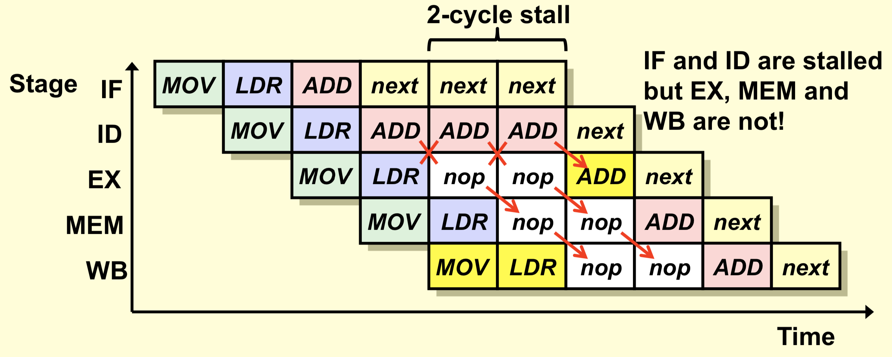
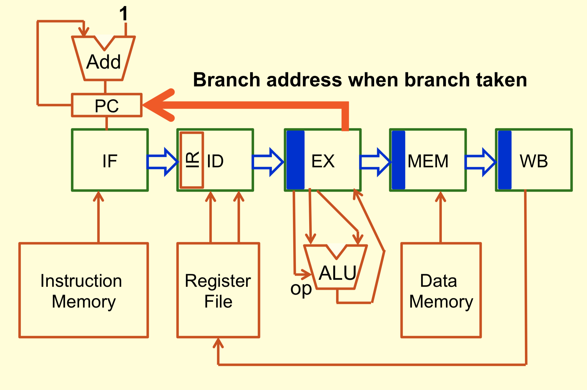

# Instruction Level Parallelism: Pipelining

The goal of pipelining is to issue instructions for every clock cycle (1 CPI). This is hard to achieve because different instructions have different dependancies and control (branching) hazards.

> A **hazard** is a problem with the CPU instruction pipeline where the next instruction cannot execute in the following clock cycle.

Pipelining came about by distinctions between existing computer architectures:

> **Complex Instruction Set Computer (CISC)** has many specialized instructions (ie x86). Requires smart compilers to optimize code and typically has less instructions than RISC programs but larger CPIs

> **Reduced Instruction Set Computer (RISC)** has a small instruction set (ie ARM or Advanced RISC Machine). Restricted addressing mode options. Instruction set focused on transistor optimization for faster execution speed. Smaller CPI but more instructions required over CISC to accomplish similar tasks.

| CISC (x86)| RISC (ARM)    | 
|:-------------|:-------------|
| *DJNZ*| *SUB* |
|       | *BNZ* |
| Decrement a register and jump if not zero | Decrement a register then jump if not zero|

RISC become popular because of its simplified compilers nd simplified processor implementation. However since RISC programs had more instructions per program than CISC in general it needed to have a faster instruction execution time. This is where pipelining comes in.

## Pipelining Processor

Processors are considered to execute 1 instruction at a time and completely finishing before executing the next.

>**Pipelining processors** are organized to execute an assembly line of instructions, executing in parallel even though the instructions are at different execution stages.

### Operation
1. Breakdown each instruction into its sequence of stages.
2. Use a clock to move all instructions in the processor to the next stage
3. Pass stages of an instruction down a pipeline. Each buffer within the pipeline is responsible for one specific task. This allows for instruction level parallelism. (ie fetch next and execute current in same clock cycle)
4. Result is that hardware is always busy.

### Classic 5-Stage Pipeline
1. **Instruction Fetch**: grab instruction from memory
2. **Instruction Dispatch**: decode and get register/immediate operands
3. **Execute**: ALU operations
4. **Memory Access**: read/write data from/to memory
5. **Writeback**: updates registers

Steps 3-5 may not be required by all instructions however for a pipelining architecture we must have an equal number of stages for all instructions (we fill unused stages with *nop*).

Datapath is organized as a pipeline (sequence of stages) where each stage takes a clock cycle each. Note that the clock cycle can only be as fast as the slowest stage along the pipeline. For the classic 5-stage pipeline this means each instruction will take 5 clock cycles from start to end.

Each stage in the pipeline is a buffer with connections to stages preceeding and proceeding itself. Information needed at a later stage is passed through the pipeline.

Due to the rigid nature of the pipeline it restricts addressing modes since the ALU operation cannot be moved in front of memory access for indirect addressing computations.

> **Harvard architecture** splits cache for instruction memory and data memory. This is vital in pipelining since memory and instruction fetch must operate in parallel. The same memory cannot be accessed in parralel.

### CPI and Execution Time Performance Benefits

If 3 instructions are processed by the 5-stage pipeline then the net cycles to complete these 3 instructions is 7. The general equation follows:

`C = (n-1) + M`

Where `C` is the cycles of execution, `n` is the number of instructions being added to the pipeline in the observation window and `M` is the number of stages defined by the pipeline. 

Alternatively in terms of time to process `n` instructions:

`Tt = Tc + (n - 1) * Tc / M`

where `Tc` is the time it takes to execute a single instruction. `Tt` is the time it takes to execute `n` instructions.

In a perfect world we can see that as the number of instructions added exceed the stages in the pipeline we complete 1 instruction every cycle which is the goal of instruction level parallelism.

## Pipelining Improvements
To increase throughput consider taking the bottleneck buffer and adding a sub-pipeline system to increase its parallelism.

In addition we want to balance server utilization across the whole system (Think of queuing networks).

We can even integrate parallel pipelines.

## Reality

> **Stall** happens when a stage in the pipeline cannot perform its required operation within the clock cycle.

Stalls can be caused by **hazards**:
- <u>cache misses:</u> Instruction fetches can add a queued buffer so that if a cache miss causes a stall the 
- <u>instruction dependancies:</u> instruction X preceedes Y in a program and so Y cannot execute until X has completed.
- <u>branching:</u> disrupts the instruction fetching order

In order to handle a stall the whole pipeline has to wait and may involve discarding previous buffer work.

### Instruction Dependancy and Overlap Conflict

When we write assembly for the processor we think sequentially:
```nasm
MOV R5, #10         ; Step 1
LDR R6, [R3, #100]  ; Step 2
ADD R4, R5, R6      ; Step 3
```
However in the pipeline each instruction is fed through by its stages. This means that instruction Y underneath instruction X may not have instruction X's executions completed by the time it needs to reference memory or registers. In order to prevent this we add *nop* instructions which are essentially wait instructions to delay stages which require prior dependancies to complete executing. The *nop* bubbles cause the pipeline to stall until data dependancy is resolved. From the asm code above we have the following space-time sequence:



We can see that in order for `ADD` to execute we need `LDR` to finish executing and updating register `R6`. Once the writeback for LDR completes we can resume and execute `ADD`. The net stall is 2 cycles in this case.

Instruction dependancies result from instruction sequencing and not processor architecture.

### Types of Hazards
1. <u>Data hazard:</u> instructions that use the same operand and data dependancies (discussed above)
2. <u>Structural hazard:</u> processor hardware needed by more than 1 instruction at the same time. An example is the ALU needed for PC incrementing and calculating operand addresses. We can solve this by seperation of concerns (building more hardware and reducing complexity)
3. <u>Control hazard:</u> branching interrupting instruction fetch cycle.

### Control Hazards and Branching

Consider the example:
```nasm

ops:
    MOV R5, #10             ; (1)
    LDR R6, [R3, #100]      ; (2)
    ADD R4, R5, R6          ; (3)
    BRA loop                ; (4)
    MOV R2, #30             ; (5)
    MOV R5, #40             ; (6)
    MOV R1, #30             ; (7)
    ADD R1, R5, R2          ; (8)

loop: 
    LDR R2, #[R4, #30]      ; (9)
    ADD R2, R5              ; (10)
```

In the pipeline at the moment instruction 4 branch execution implements at the last stage (write back to PC), instructions 5-8 are already in the pipeline and some like instruction 5 and 6 have completed memory writes modifying the system state. We want to purge the pipeline when a branch is performed but before any system state modifying actions take place (in the memory write stage).

To solve this we implement a change to the execution stage by initiating a change to the PC if a branch is made. Since the execution stage is before the memory write stage:



Since each branch requires a pipeline purge, each time a branch happens in a program there is an associated branch penalty which can be a number of clock cycles. This also has implications for the instruction prefetch buffer queue which may become obsolete if it needs to be purged as it takes a little longer to refresh the the queue than just sending the fetched instruction directly to the instruction decoder.

#### Branch Reduction Processes

1. Delayed branch
2. Instruction decode branch execution
3. Branch prediction

> **Delayed Branch**
> Moving the branch instruction 'up' some number of instructions allows for the instructions we *know* will be executed to fill the pipeline first. Once the branch is validated we don't need to flush the pipeline because the only instructions in the pipeline are those executing before the branch. This allows the prefetch to start fetching the instruction at the branched location as normal and no *nop* filling is required.

> **Instruction Decode Branch Execution**
> Updates PC earlier than execution stage. However the execution stage is still needed in order to resolve conditional branches which have a data dependancy on register flags set by ALU.

> **Branch Prediction**
> Tries to predict PC for conditional branching instructions. Can use dynamic predictors to make intelligent branch predictions using data analytics.
> **Speculation** uses a seperate set of registers and values to speculatively assume a branch outcome and then merge to the correct branch outcome pipeline once the branch is computed.

## Limitations of Pipelining Architecture

Best performance speedup using pipelining occurs for 2 conditions:
1. Long sequence of uninterrupted (no branch instructions) instructions with no data dependancies
2. Pipelining stage buffer utilization distributed equally among all stages. (All stages take roughly equal amount of time to execute)

In the real world these conditions are hard to always satisfy and so we get the following performance losses:
1. Branch prediction miss requiring pipeline flush. The more stages, the larger the flush penalty.
2. Co-pipeline instruction dependancies requiring pipeline stalls (*nop*)
3. Instruction latency and server utilization mismatch. The clock can only be as fast as the slowest stage in the pipeline.